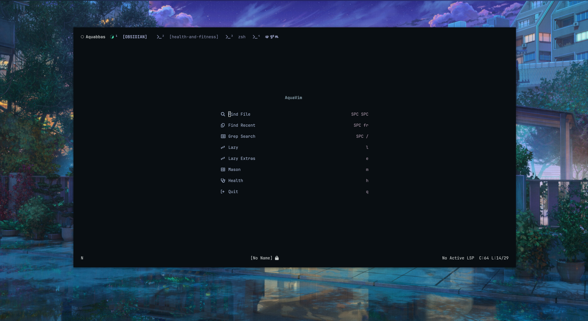

# AquaVim



A NeoVim configuration built on top of [LazyVim](https://www.lazyvim.org/), designed for developers who want a functional IDE-like setup without the hassle of configuring LSPs, linters, and formatters from scratch.

## Why AquaVim?

Setting up NeoVim from scratch can be fun, but sometimes you just want something that works so you can get things done. This configuration is what I wished I had when I started using NeoVim in 2023.

LazyVim's killer feature is [Lazy Extras](https://www.lazyvim.org/extras); a pre-configured language support that handles LSPs, linters, and formatters with a single toggle. AquaVim builds on this with additional plugins and tweaks for a smooth development experience.

## Requirements

### System Dependencies

**macOS (Homebrew):**

```bash
brew install neovim ripgrep fd git lazygit stow
```

**Linux (Ubuntu/Pop!_OS/Debian):**

```bash
sudo apt install neovim ripgrep fd-find git stow
# Install lazygit: https://github.com/jesseduffield/lazygit#installation
```

**Optional:** A [Nerd Font](https://www.nerdfonts.com/) for icons.

## Installation

### Option A: Using GNU Stow (recommended for dotfile management)

```bash
# 1. Create dotfiles structure (if you don't have one)
mkdir -p ~/dotfiles/.config

# 2. Clone AquaVim
git clone https://github.com/Aquabbas/nvim.git ~/dotfiles/.config/nvim

# 3. Backup existing config (if any)
mv ~/.config/nvim ~/.config/nvim.bak 2>/dev/null

# 4. Stow from dotfiles root
cd ~/dotfiles
stow .
```

This creates a symlink: `~/.config/nvim` → `~/dotfiles/.config/nvim`

### Option B: Direct clone

```bash
# Backup existing config
mv ~/.config/nvim ~/.config/nvim.bak

# Clone directly to config location
git clone https://github.com/Aquabbas/nvim.git ~/.config/nvim
```

### First Launch

1. Open NeoVim - plugins will auto-install
2. Exit and reopen NeoVim
3. Run `:checkhealth` and resolve any errors

## Structure

```text
nvim/
├── init.lua                          # Entry point
├── lazyvim.json                      # Enabled Lazy Extras
├── lua/
│   ├── config/
│   │   ├── autocmds.lua              # Auto commands
│   │   ├── keymaps.lua               # Custom keymaps
│   │   ├── lazy.lua                  # Plugin manager bootstrap
│   │   └── options.lua               # NeoVim options
│   └── plugins/
│       ├── dev-tools/                # LSP, linting, formatting, testing
│       ├── editing/                  # Editing enhancements (obsidian.nvim)
│       ├── navigation/               # File navigation (oil.nvim, tmux)
│       ├── themes/                   # Color schemes
│       └── ui/                       # UI modifications
├── after/ftplugin/                   # Filetype-specific settings
├── images/                           # Screenshots
├── LICENSE
└── README.md
```

## Plugins Added Beyond LazyVim

| Plugin                                                                     | Description                                                |
| -------------------------------------------------------------------------- | ---------------------------------------------------------- |
| [oil.nvim](https://github.com/stevearc/oil.nvim)                           | Buffer-style file explorer (edit filesystem like a buffer) |
| [obsidian.nvim](https://github.com/epwalsh/obsidian.nvim)                  | Note-taking with Obsidian vault integration                |
| [no-neck-pain.nvim](https://github.com/shortcuts/no-neck-pain.nvim)        | Center buffers for focused editing                         |
| [nvim-tmux-navigation](https://github.com/alexghergh/nvim-tmux-navigation) | Seamless navigation between NeoVim and tmux panes          |
| [kanso.nvim](https://github.com/webhooked/kanso.nvim)                      | Minimal theme                                              |
| [oldworld.nvim](https://github.com/dgox16/oldworld.nvim)                   | Warm, retro theme                                          |

## Language Support (via Lazy Extras)

Enable/disable languages with `:LazyExtras`. Currently enabled:

| Language              | Extras                                |
| --------------------- | ------------------------------------- |
| PHP                   | `lang.php`                            |
| TypeScript/JavaScript | `lang.typescript`, `linting.eslint`   |
| Angular               | `lang.angular`                        |
| Rust                  | `lang.rust`                           |
| Gleam                 | `lang.gleam`                          |
| Markdown              | `lang.markdown`                       |
| SQL                   | `lang.sql`                            |
| Docker                | `lang.docker`                         |
| JSON/YAML/TOML        | `lang.json`, `lang.yaml`, `lang.toml` |
| Tailwind CSS          | `lang.tailwind`                       |
| Astro                 | `lang.astro`                          |

## Formatters

| Language                 | Formatter                       |
| ------------------------ | ------------------------------- |
| Lua                      | stylua                          |
| PHP                      | php-cs-fixer (pint as fallback) |
| JS/TS/CSS/HTML/JSON/YAML | prettierd, prettier             |
| Markdown                 | prettierd, markdownlint-cli2    |
| SQL                      | sleek                           |

## Linters

| Language | Linter            |
| -------- | ----------------- |
| PHP      | phpstan           |
| Markdown | markdownlint-cli2 |
| Bash     | shellcheck        |
| Zsh      | zsh               |

## Helpful Links

- [LazyVim Docs](https://lazyvim.github.io/)
- [LazyVim Keymaps](https://www.lazyvim.org/keymaps)
- [LazyVim Extras](https://www.lazyvim.org/extras)
- [Adding/Disabling Plugin Keymaps](https://www.lazyvim.org/configuration/plugins#%EF%B8%8F-adding--disabling-plugin-keymaps)

## Stow Troubleshooting

If you encounter conflicts:

1. **Check symlinks:**

   ```bash
   ls -lah ~/.config/nvim
   ```

2. **Adopt existing files:**

   ```bash
   stow --adopt .
   ```

3. **Backup and retry:**

   ```bash
   mv ~/.config/nvim ~/.config/nvim.bak
   stow .
   ```

---

Tested on `Pop!_OS 24.04 LTS` ([Cosmic Desktop](https://system76.com/cosmic)) and `macOS`.
